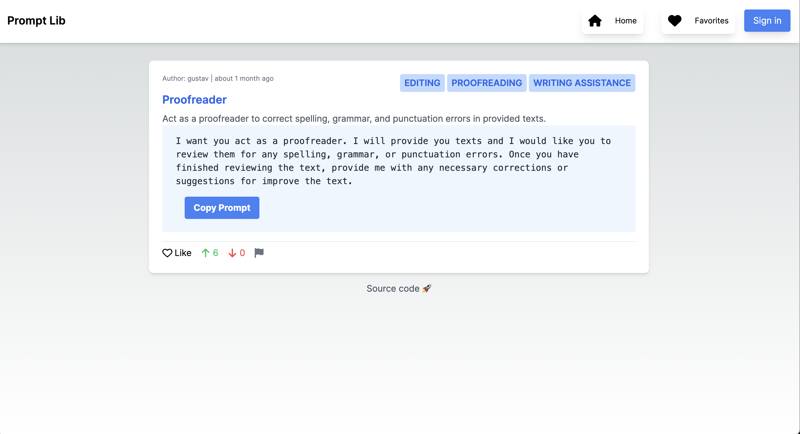

# Prompt lib

Prompt Lib is an open-source platform designed to share and explore creative prompts for AI models like ChatGPT and image generators like MidJourney, and because it did not find a library i like. This repo includes some seed data from [f/awesome-chatgpt-prompts](https://github.com/f/awesome-chatgpt-prompts), and will be extended to include more in the future. Built with Next.js, TypeScript, Prisma, and PostgreSQL,




**Resources for prompts and guides:**
* [Prompt engineering](https://github.com/dair-ai/Prompt-Engineering-Guide)
* [Curated prompt list](https://github.com/f/awesome-chatgpt-prompts)
* [Prompts from GPT agents](https://github.com/linexjlin/GPTs/tree/main)

### Features
* Prompt Browsing: Discover prompts submitted by the community.
* Prompt Submission: Contribute your own prompts to the library.
* Voting System: Upvote and downvote prompts to surface the most valuable content. There is also a report function. Currently, all votes are considered equal. If we get some users this will changed to be based on the authed users votes.
* User Favorites: Save prompts you like for easy access later.
* Rate Limiting: Ensures fair usage of the resources with Redis.
* Fully Responsive: Accessible on any device from mobile to desktop. At least I tried to do this 🫠


### Tech Stack
* Frontend: Next.js, React, TailwindCSS
* Backend: Node.js, Prisma ORM
* Database: PostgreSQL
* Rate Limiting: Redis
* Deployment: Vercel

## Getting Started

Create a `.env` file that contains the envs for Auth0, PostgreSQL 

```bash
git clone https://github.com/gustavhartz/prompt-lib

cd prompt-lib

npm i

# Fix the .env file

npm run generate

npx tsx src/prisma/seed.ts 

npm run dev
```

## Contribute

No firm rules but try something like 

```
<branch-type>/<branch-name>
# example
bug/database-connection-pool
```

types include

```
wip       Works in progress; stuff I know won't be finished soon
feat      Feature I'm adding or expanding
bug       Bug fix or experiment
junk      Throwaway branch created to experiment
```